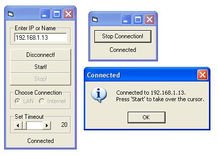



## overtake the cursor on a pc over lan or internet\!

### Description

this is the latest version! it works 20 times faster than the old one and you can click!

this code allows you to take over the cursor on a computer over lan or internet (haven't tested it over internet yet, but i believe it works). it only uses 4 api funktions (get cursor, set cursor, mouse event and sleep). if it doesn't work good try to change the timeout - in my lan it worked perfect with 25 millsec timeout. i've tested it only with win xp but it should also work with win 2000 and ME. it's impossible to run this prg on win 98 and 95.

please leave some comments.
 
### More Info
 

             |
---                |---
**Submitted On**   |2004-03-27 17:08:32
**By**             |[mata](https://github.com/Planet-Source-Code/PSCIndex/blob/master/ByAuthor/mata.md)
**Level**          |Intermediate
**User Rating**    |5.0 (10 globes from 2 users)
**Compatibility**  |VB 6\.0
**Category**       |[Jokes/ Humor](https://github.com/Planet-Source-Code/PSCIndex/blob/master/ByCategory/jokes-humor__1-40.md)
**World**          |[Visual Basic](https://github.com/Planet-Source-Code/PSCIndex/blob/master/ByWorld/visual-basic.md)
**Archive File**   |[overtake\_t1725213272004\.zip](https://github.com/Planet-Source-Code/mata-overtake-the-cursor-on-a-pc-over-lan-or-internet__1-52644/archive/master.zip)

